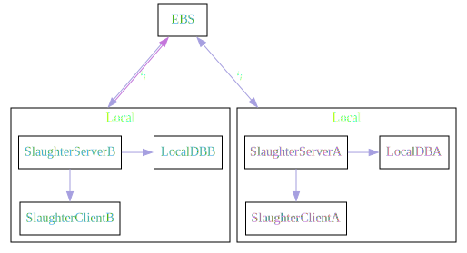

# Table of Contents

1.  [使用](#org71534be)
2.  [字体样式](#org1662c0c)
3.  [特殊说明](#org196958e)
    1.  [quote 摘要、引用](#orgd2e1f4d)
    2.  [notice 注意事项、提醒](#orgeec19b7)
4.  [段落及高亮](#orgdcb01d6)
5.  [表格](#org559b469)
    1.  [awk 表格](#org8492a4b)
    2.  [表格自增id](#org9f043db)
6.  [LaTex 公式](#orgaacfb4b)
7.  [代码](#org35141ba)
    1.  [Java代码](#org94e5214)
    2.  [babel java](#org3f325cc)
8.  [图片](#org8d6c02a)
    1.  [引用本地图片](#org7f1b8f4)
    2.  [引用网络图片](#org62a1998)
    3.  [dot graphviz](#org15cd23a)
    4.  [plantuml](#org6255d7e)
9.  [org转Word](#orgd4e2cf7)
10. [插入时间](#org776fc4f)

> 样式引用：<https://docs.doomemacs.org/latest/#/modules>  

  

# 使用

配置 **snippet** 模版，然后在 **org mode** 文件中使用 `t` `t` `tab` 就可展开此模版。  

    # -*- mode: snippet -*-
    # name: title
    # key: tt
    # --
    #+title: `(file-name-sans-extension (buffer-name))`
    #+SUBTITLE: this is subtitle
    #+AUTHOR: autor
    #+HTML_HEAD: 
    #+HTML_HEAD: <link rel="stylesheet" type="text/css" href="./css/org_css.css"/>
    #+HTML_HEAD: 
    #+OPTIONS: prop:nil timestamp:t \n:t ^:nil f:t toc:t author:t num:t H:2
    #+LATEX_COMPILER: xelatex
    #+LATEX_CLASS: elegantpaper
    #+MACRO: htmlred @@html:@@
    #+MACRO: latexred @@latex:{\color{red}@@@@latex:}@@
    #+latex:\newpage

想使用在线版的静态文件，可以使用下面的配置进行替换 

    <link href="https://emacs-1308440781.cos.ap-chengdu.myqcloud.com/org_css.css" rel="stylesheet"></link>
    

# 字体样式

<table border="2" cellspacing="0" cellpadding="6" rules="groups" frame="hsides">
<caption class="t-bottom">Table 1: 字体样式说明</caption>

<colgroup>
<col  class="org-left" />

<col  class="org-left" />
</colgroup>
<tbody>
<tr>
<td class="org-left">粗体</td>
<td class="org-left"><b>bold</b></td>
</tr>

<tr>
<td class="org-left">斜体</td>
<td class="org-left"><i>italic</i></td>
</tr>

<tr>
<td class="org-left">下划线</td>
<td class="org-left">underlined</td>
</tr>

<tr>
<td class="org-left">中横线</td>
<td class="org-left"><del>strike-through</del></td>
</tr>

<tr>
<td class="org-left">代码，按键</td>
<td class="org-left"><code>code</code></td>
</tr>
</tbody>
</table>

# 特殊说明

## quote 摘要、引用

可使用\`quote\`来进行代码块补全，表示摘要，引用  

> TECO - Tape [later text] Editor/COrrector  
> A combination text editor/really horrible ProgrammingLanguage. To quote the paper &ldquo;RealProgrammers don&rsquo;t use Pascal&rdquo; (1983):  

## notice 注意事项、提醒

你有许多已标记的项目并且你可能错过一个重要的项目时，提醒可以提供帮助 

Please do not file or answer Doom Emacs issues on Reddit, Twitter, or StackOverflow. Kindly refer them to this section. 

这是1个例子 

# 段落及高亮

Example of an  comment.  

原文：[用友bip产品功能说明](https://iuap.yonyoucloud.com/doc/yonbuilder.html#/md-build/yonbuilder/articles/yonbuilder/1-/notes.md?key=%E5%8F%91%E7%89%88%E8%AF%B4%E6%98%8E) ，在说明文档  

大数据中 **最宝贵** 、最难以代替的就是数据，一切都围绕数据。  

HDFS是最早的大数据存储系统，存储着宝贵的数据资产，各种新算法、框架要想得到广泛使用，必须支持HDFS，才能获取已存储在里面的数据。所以大数据技术越发展，新技术越多，HDFS得到的支持越多，越离不开HDFS。HDFS也许不是最好的大数据存储技术，但依然是最重要的大数据存储技术。  

HDFS是如何实现大数据高速、可靠的存储和访问的呢？  

-   Hadoop分布式文件系统HDFS的设计目标是管理数以千计的服务器、数以万计的磁盘，将大规模的服务器计算资源当作一个单一存储系统进行管理，对应用程序提供数以PB计的存储容量，让应用程序像使用普通文件系统一样存储大规模的文件数据。

# 表格

`C-c ~` to convert to tabel.el table  
`C-c ~` to convert to org table  
org table `M-h` `M-l` for move Columns left and right  
org table `M-k` `M-j` for move Rows up and down  

    # table.el for merge Columns or Rows

<table border="2" cellspacing="0" cellpadding="6" rules="groups" frame="hsides">
<caption class="t-bottom">Table 2: square</caption>

<colgroup>
<col  class="org-right" />
</colgroup>

<colgroup>
<col  class="org-right" />

<col  class="org-right" />

<col  class="org-right" />
</colgroup>

<colgroup>
<col  class="org-right" />

<col  class="org-right" />
</colgroup>
<thead>
<tr>
<th scope="col" class="org-right">N</th>
<th scope="col" class="org-right">N^2</th>
<th scope="col" class="org-right">N^3</th>
<th scope="col" class="org-right">N^4</th>
<th scope="col" class="org-right">sqrt(n)</th>
<th scope="col" class="org-right">sqrt[4](N)</th>
</tr>
</thead>

<tbody>
<tr>
<td class="org-right">1</td>
<td class="org-right">1</td>
<td class="org-right">1</td>
<td class="org-right">1</td>
<td class="org-right">1</td>
<td class="org-right">1</td>
</tr>

<tr>
<td class="org-right">2</td>
<td class="org-right">4</td>
<td class="org-right">8</td>
<td class="org-right">16</td>
<td class="org-right">1.4142136</td>
<td class="org-right">1.1892071</td>
</tr>

<tr>
<td class="org-right">3</td>
<td class="org-right">9</td>
<td class="org-right">27</td>
<td class="org-right">81</td>
<td class="org-right">1.7320508</td>
<td class="org-right">1.3160740</td>
</tr>
</tbody>
</table>

<table border="2" cellspacing="0" cellpadding="6" rules="groups" frame="hsides">
<caption class="t-bottom">Table 3: student</caption>

<colgroup>
<col  class="org-left" />

<col  class="org-right" />

<col  class="org-right" />

<col  class="org-right" />

<col  class="org-right" />

<col  class="org-right" />
</colgroup>
<thead>
<tr>
<th scope="col" class="org-left">Student</th>
<th scope="col" class="org-right">Prob 1</th>
<th scope="col" class="org-right">Prob 2</th>
<th scope="col" class="org-right">Prob 3</th>
<th scope="col" class="org-right">Total</th>
<th scope="col" class="org-right">Note</th>
</tr>
</thead>

<tbody>
<tr>
<td class="org-left">Maximum</td>
<td class="org-right">10</td>
<td class="org-right">15</td>
<td class="org-right">25</td>
<td class="org-right">50</td>
<td class="org-right">10.0</td>
</tr>
</tbody>

<tbody>
<tr>
<td class="org-left">Peter</td>
<td class="org-right">10</td>
<td class="org-right">8</td>
<td class="org-right">23</td>
<td class="org-right">41</td>
<td class="org-right">8.2</td>
</tr>

<tr>
<td class="org-left">Sam</td>
<td class="org-right">2</td>
<td class="org-right">4</td>
<td class="org-right">3</td>
<td class="org-right">9</td>
<td class="org-right">1.8</td>
</tr>
</tbody>

<tbody>
<tr>
<td class="org-left">Average</td>
<td class="org-right">&#xa0;</td>
<td class="org-right">&#xa0;</td>
<td class="org-right">&#xa0;</td>
<td class="org-right">25.0</td>
<td class="org-right">&#xa0;</td>
</tr>
</tbody>
</table>

<table border="2" cellspacing="0" cellpadding="6" rules="groups" frame="hsides">
<caption class="t-bottom">Table 4: long table</caption>

<colgroup>
<col  class="org-left" />

<col  class="org-left" />

<col  class="org-left" />

<col  class="org-left" />

<col  class="org-left" />

<col  class="org-left" />

<col  class="org-right" />

<col  class="org-right" />
</colgroup>
<thead>
<tr>
<th scope="col" class="org-left">Format</th>
<th scope="col" class="org-left">Fine-grained-control</th>
<th scope="col" class="org-left">Initial Effort</th>
<th scope="col" class="org-left">Syntax simplicity</th>
<th scope="col" class="org-left">Editor Support</th>
<th scope="col" class="org-left">Integrations</th>
<th scope="col" class="org-right">Ease-of-referencing</th>
<th scope="col" class="org-right">Versatility</th>
</tr>
</thead>

<tbody>
<tr>
<td class="org-left">Word</td>
<td class="org-left">Word^2</td>
<td class="org-left">Word^3</td>
<td class="org-left">Word^4</td>
<td class="org-left">sqrt(Word)</td>
<td class="org-left">sqrt(sqrt(Word))</td>
<td class="org-right">2</td>
<td class="org-right">2</td>
</tr>

<tr>
<td class="org-left">LaTeX</td>
<td class="org-left">LaTeX^2</td>
<td class="org-left">LaTeX^3</td>
<td class="org-left">LaTeX^4</td>
<td class="org-left">sqrt(LaTeX)</td>
<td class="org-left">sqrt(sqrt(LaTeX))</td>
<td class="org-right">4</td>
<td class="org-right">3</td>
</tr>

<tr>
<td class="org-left">Org Mode</td>
<td class="org-left">Org^2 Mode^2</td>
<td class="org-left">Org^3 Mode^3</td>
<td class="org-left">Org^4 Mode^4</td>
<td class="org-left">sqrt(Org Mode)</td>
<td class="org-left">sqrt(sqrt(Org Mode))</td>
<td class="org-right">4</td>
<td class="org-right">4</td>
</tr>

<tr>
<td class="org-left">Markdown</td>
<td class="org-left">Markdown^2</td>
<td class="org-left">Markdown^3</td>
<td class="org-left">Markdown^4</td>
<td class="org-left">sqrt(Markdown)</td>
<td class="org-left">sqrt(sqrt(Markdown))</td>
<td class="org-right">3</td>
<td class="org-right">1</td>
</tr>

<tr>
<td class="org-left">Markdown + Pandoc</td>
<td class="org-left">(Markdown + Pandoc)^2</td>
<td class="org-left">(Markdown + Pandoc)^3</td>
<td class="org-left">(Markdown + Pandoc)^4</td>
<td class="org-left">sqrt(Markdown + Pandoc)</td>
<td class="org-left">sqrt(sqrt(Markdown + Pandoc))</td>
<td class="org-right">3</td>
<td class="org-right">2</td>
</tr>
</tbody>
</table>

## awk 表格

<table id="org1c55b71" border="2" cellspacing="0" cellpadding="6" rules="groups" frame="hsides">

<colgroup>
<col  class="org-left" />

<col  class="org-right" />

<col  class="org-left" />

<col  class="org-left" />
</colgroup>
<tbody>
<tr>
<td class="org-left">aardvark</td>
<td class="org-right">555-5553</td>
<td class="org-left">1200/300</td>
<td class="org-left">B</td>
</tr>

<tr>
<td class="org-left">alpo-net</td>
<td class="org-right">555-3412</td>
<td class="org-left">2400/1200/300</td>
<td class="org-left">A</td>
</tr>

<tr>
<td class="org-left">barfly</td>
<td class="org-right">555-7685</td>
<td class="org-left">1200/300</td>
<td class="org-left">A</td>
</tr>

<tr>
<td class="org-left">bites</td>
<td class="org-right">555-1675</td>
<td class="org-left">2400/1200/300</td>
<td class="org-left">A</td>
</tr>

<tr>
<td class="org-left">camelot</td>
<td class="org-right">555-0542</td>
<td class="org-left">300</td>
<td class="org-left">C</td>
</tr>

<tr>
<td class="org-left">core</td>
<td class="org-right">555-2912</td>
<td class="org-left">1200/300</td>
<td class="org-left">C</td>
</tr>

<tr>
<td class="org-left">fooey</td>
<td class="org-right">555-1234</td>
<td class="org-left">2400/1200/300</td>
<td class="org-left">B</td>
</tr>

<tr>
<td class="org-left">foot</td>
<td class="org-right">555-6699</td>
<td class="org-left">1200/300</td>
<td class="org-left">B</td>
</tr>

<tr>
<td class="org-left">macfoo</td>
<td class="org-right">555-6480</td>
<td class="org-left">1200/300</td>
<td class="org-left">A</td>
</tr>

<tr>
<td class="org-left">sdace</td>
<td class="org-right">555-3430</td>
<td class="org-left">2400/1200/300</td>
<td class="org-left">A</td>
</tr>

<tr>
<td class="org-left">sabafoo</td>
<td class="org-right">555-2127</td>
<td class="org-left">1200/300</td>
<td class="org-left">C</td>
</tr>
</tbody>
</table>

    /foo/ { print $0 }

<table border="2" cellspacing="0" cellpadding="6" rules="groups" frame="hsides">
<caption class="t-bottom">Table 5: 筛选出foo匹配的行</caption>

<colgroup>
<col  class="org-left" />

<col  class="org-right" />

<col  class="org-left" />

<col  class="org-left" />
</colgroup>
<tbody>
<tr>
<td class="org-left">fooey</td>
<td class="org-right">555-1234</td>
<td class="org-left">2400/1200/300</td>
<td class="org-left">B</td>
</tr>

<tr>
<td class="org-left">foot</td>
<td class="org-right">555-6699</td>
<td class="org-left">1200/300</td>
<td class="org-left">B</td>
</tr>

<tr>
<td class="org-left">macfoo</td>
<td class="org-right">555-6480</td>
<td class="org-left">1200/300</td>
<td class="org-left">A</td>
</tr>

<tr>
<td class="org-left">sabafoo</td>
<td class="org-right">555-2127</td>
<td class="org-left">1200/300</td>
<td class="org-left">C</td>
</tr>
</tbody>
</table>

## 表格自增id

<table border="2" cellspacing="0" cellpadding="6" rules="groups" frame="hsides">

<colgroup>
<col  class="org-right" />

<col  class="org-left" />

<col  class="org-left" />
</colgroup>
<tbody>
<tr>
<td class="org-right">0</td>
<td class="org-left">字段名</td>
<td class="org-left">名称</td>
</tr>

<tr>
<td class="org-right">1</td>
<td class="org-left">age</td>
<td class="org-left">年龄</td>
</tr>

<tr>
<td class="org-right">2</td>
<td class="org-left">bir</td>
<td class="org-left">出生年月日</td>
</tr>
</tbody>
</table>

    #+tblfm: $1=@#-1

`C-c` `C-c` to execute it  

# LaTex 公式

    $\mbox{需求的价格弹性系数} = \frac{\mbox{需求的变动率}}{\mbox{价格的变动率}}$

$$\mbox{需求的价格弹性系数} = \frac{\mbox{需求的变动率}}{\mbox{价格的变动率}}$$  

$$\begin{aligned}
\cos 3\theta & = \cos (2 \theta + \theta) \\
& = \cos 2 \theta \cos \theta - \sin 2 \theta \sin \theta \\
& = (2 \cos ^2 \theta -1) \cos \theta - (2 \sin \theta\cos \theta ) \sin \theta \\
& = 2 \cos ^3 \theta - \cos \theta - 2 \sin ^2 \theta \cos \theta \\
& = 2 \cos ^3 \theta - \cos \theta - 2 (1 - \cos ^2 \theta )\cos \theta \\
& = 4 \cos ^3 \theta -3 \cos \theta
\end{aligned} $$  

# 代码

## Java代码

    
    /**
     * @param request 调用的请求参数
     * @param needLog true 需要记录日志  false 不记录日志
     * @return
     */
    protected NcApiResponse runApply(NcApiRequest request, Boolean needLog) {
        NcApiResponse ncApiResponse = null;
        try {
            final NcApiRequest ncApiRequest = executeBefore(request);
            ncApiResponse = executeGetRequest(ncApiRequest);
        } catch (Exception e) {
            afterExecute(needLog, e, request, ncApiResponse);
            if (e instanceof BizException) {
                throw new BizException("NC提示", ((BizException) e).getErrorMsg(), e);
            } else {
                throw new BizException("NC异常", e.getMessage());
            }
        }
    
        return ncApiResponse;
    }

## babel java

    List<Integer> a = Arrays.asList(1, 2);
    return a;

`C-c` `C-c` to execute it, but export to html will fail when the babel java result generated.  

# 图片

## 引用本地图片

  

## 引用网络图片

  

## dot graphviz

  

## plantuml

1.  plantuml with style css

    plantuml 替换原生样式  
    DARKORANGE/LIGHTORANGE/DARKBLUE/LIGHTBLUE/DARKRED/LIGHTRED/DARKGREEN/LIGHTGREEN  
    
        !define DARKORANGE
        !includeurl /Users/van/org/org-roam/C4-PlantUML/juststyle.puml
    
      

2.  plant uml 系统Contex架构图

    plantuml 替换原生样式  
    DARKORANGE/LIGHTORANGE/DARKBLUE/LIGHTBLUE/DARKRED/LIGHTRED/DARKGREEN/LIGHTGREEN  
    
        !define DARKBLUE
        !includeurl /Users/van/org/org-roam/C4-PlantUML/juststyle.puml
    
      

# org转Word

    pandoc -o ~/Desktop/out.docx ~/.doom.d/README.org

# 插入时间

<table border="2" cellspacing="0" cellpadding="6" rules="groups" frame="hsides">

<colgroup>
<col  class="org-left" />

<col  class="org-left" />
</colgroup>
<tbody>
<tr>
<td class="org-left"><code>C-c .</code></td>
<td class="org-left">插入当前时间 &lt;2023-02-25 Sat&gt;</td>
</tr>

<tr>
<td class="org-left"><code>K</code></td>
<td class="org-left">lask week</td>
</tr>

<tr>
<td class="org-left"><code>J</code></td>
<td class="org-left">next week</td>
</tr>

<tr>
<td class="org-left"><code>L</code></td>
<td class="org-left">next day</td>
</tr>
</tbody>
</table>

